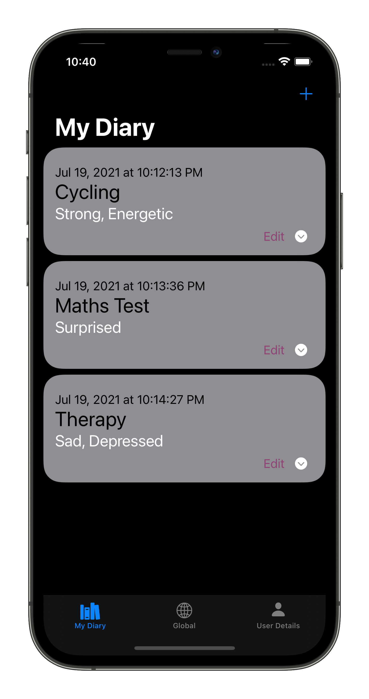
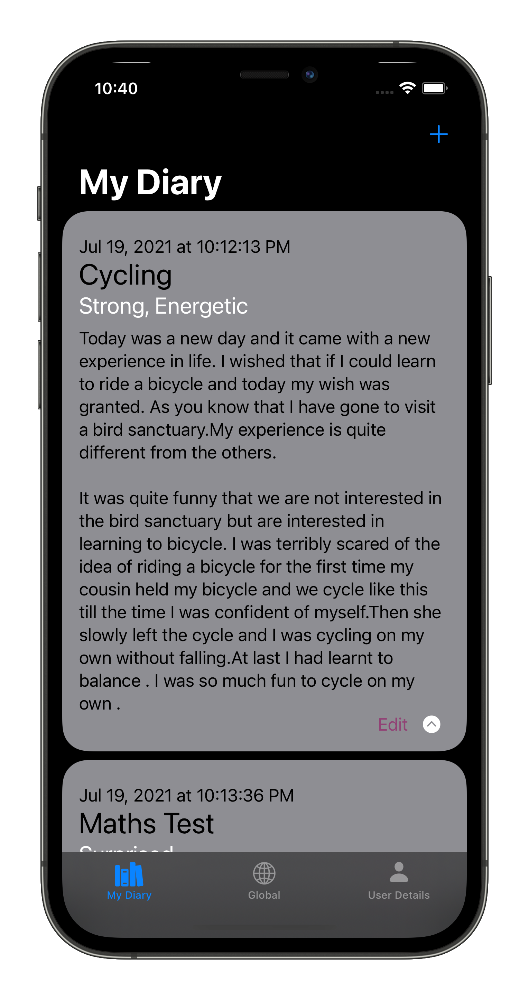
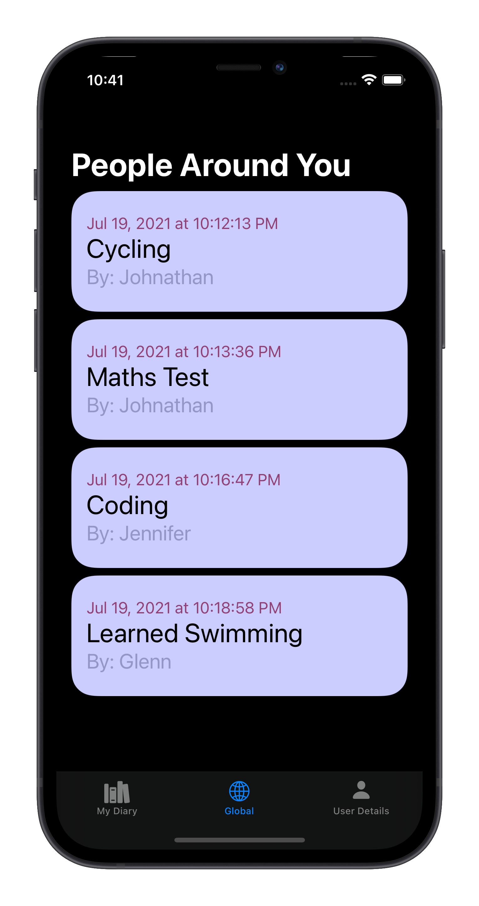
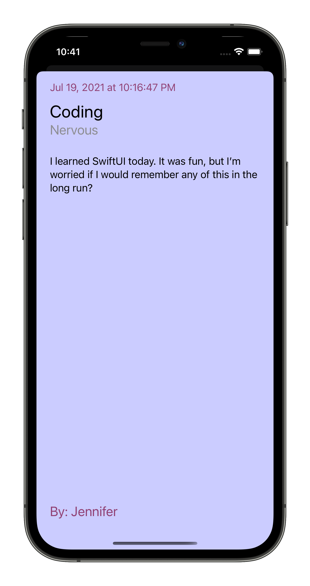
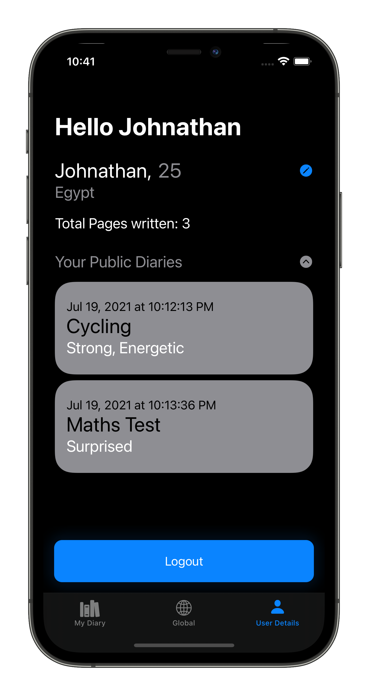
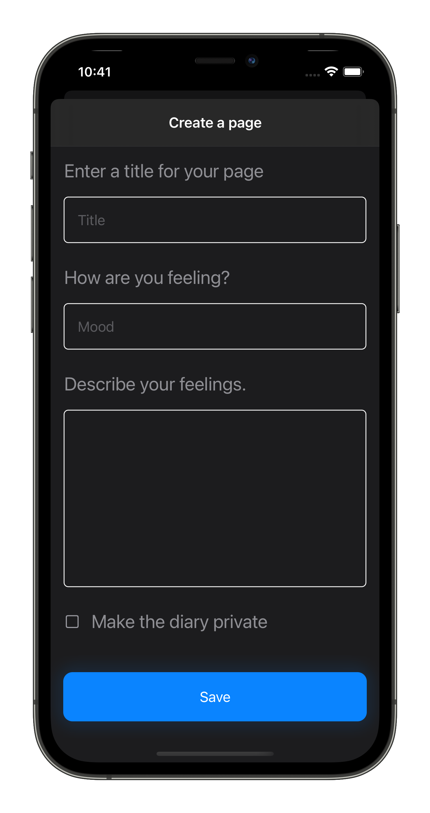

## Diary App using SwiftUI and MongoDB Realm

The app allows users to write a diary, and share with everyone else. 

### Features

* Authentication using Realm Auth
* CRUD operations on Realm, deployed to MongoDB Compass and DigitalOcean.

### Screenshots

  
  
  
